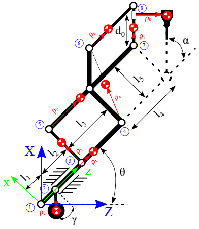
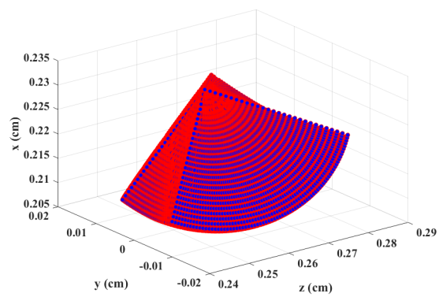

# ARASH ASiST (ARAS Haptic System for Eye Surgery Training) Dynamic Modeld, related to the article:

One of the most challenging operations in clinical practice is intraocular eye surgery. Human eyes are delicate and highly complex organs, and the accuracy required for most intraocular surgeries ranges from 50 − 100µm. Typically, intraocular surgeries are considered as a micro-surgical procedure, and during surgery, surgeons must carefully control the position and force of a small surgical instrument in an area of limited workspace with a delicate positioning accuracy. In order to address these challenges, robotic technology may come to the rescue. By using robot–assisted surgery, surgeons can perform microsurgeries with high levels of accuracy and dexterity, in a comfortable and ergonomic environment.

ARASH:ASiST has been developed in **Advanced Robotics and Automated Systems (ARAS)** for eye surgery training. This device has 3-DOF haptic interface, developed for use in a dual haptic eye surgery training system [4]. Considering its mechanical features, this device provides the main required minimally invasive vitrectomy surgery properties, such as the remote center of motion and favorable kinematic workspace. ARASH:ASiST provides more than 90◦ in both rotational motions, 43:6mm in the insertion direction of the surgical instrument. Furthermore, it is equipped with two symmetrical weight counterbalances for weight compensation of the mechanism.

 

# Kinematic and Dynamic Analysis

[1] A. Hassani et al., "Kinematic and Dynamic Analysis of ARASH ASiST: Toward Micro Positioning," 2021 9th RSI International Conference on Robotics and Mechatronics (ICRoM), 2021, pp. 59-65, doi: 10.1109/ICRoM54204.2021.9663516.

Paper abstract: This article elaborate on the kinematic and dynamic analysis of ARASH:ASiST, ”ARAS Haptic System for Eye Surgery Training”, which is developed for vitrectomy eye surgery training. The mechanism selection of this system is reviewed first, in order to assist such a precise intraocular eye surgery training. Then the kinematics and dynamics analysis of the proposed haptic system is investigated. To verify the reported result, a prototype of ARASH:ASiST is modeled in MSC-ADAMS , and the results of the dynamic formulation are validated. Finally, a common model-based controller is implemented on the real prototype, and it is verified that with such controller a suitable accuracy of 200 μm is attainable for the surgical instrument.

 **Paper Link:** https://ieeexplore.ieee.org/document/9663516

 

# Dynamic Parameter Identification 

[2] A. Hassani et al., "On The Dynamic Calibration and Trajectory Control of ARASH:ASiST," 2022 8th International Conference on Control, Instrumentation and Automation (ICCIA), 2022, pp. 1-6, doi: 10.1109/ICCIA54998.2022.9737158.

Paper abstract: This article investigates the dynamic parameter calibration of ARAS Haptic System for EYE Surgery Training (ARASH:ASiST). ARASH:ASiST is a 3-DOF haptic device developed for intraocular surgery training. In this paper, the linear regression form of the dynamic formulation of the system with respect to its dynamic parameters is derived. Then the dynamic parameters of ARASH:ASiST are calibrated using the least square (LS) identification scheme. The cross-validation results for different trajectories indicate that the identified model has a suitable approximate fitness percentage in both translational and rotational motions of the surgical instrument. Finally, a robust model-based controller is implemented on the real prototype by the use of the calibration outcome, and it is verified that by using the estimated dynamic model, the trajectory tracking performance is significantly improved and the tracking error is reduced 50% compared to that of using the nominal dynamic model of the robot.

 **Paper Link:** https://ieeexplore.ieee.org/document/9737158

